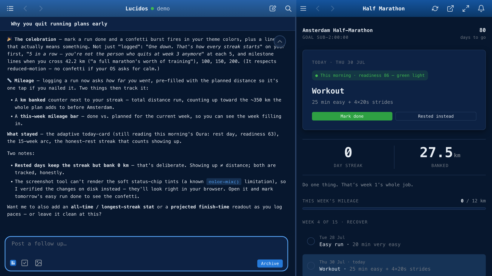

# Lucidos

[](https://lucidos.dev)

<sub>Described in chat, running seconds later in the same window, wired to the user's own data. [60-second demo](https://www.youtube.com/watch?v=hNN5bL1nq7k) &middot; [lucidos.dev](https://lucidos.dev) &middot; macOS DMG, or one line on macOS and Linux.</sub>

<!--intro-start-->
Lucidos is an AI companion that shares your whole workspace. You talk, build, run, automate, and remember together - in one place. Chat lives alongside your work in a persistent split view on desktop, and as a separate pane you can swipe to on mobile. You're never leaving your work to talk to the AI; you're always working with it - manifesting your intent in a rich, extensible interface.

> *If you can describe it, it exists*

A local, event-driven AI OS that keeps the apps you describe running, and acts when something happens. It is the environment your apps, data, automations, and memory live in, all on your own machine. You own and store all the data yourself. The prompt is the primary interface, but Lucidos is a unified, integrated environment where configurable LLMs know all about your apps, triggers (scheduled or event-driven), and files. Describe an app and you're using it seconds later. No build step, no deploy. Built to augment the *user*, it remembers everything you do. While it is not an "autonomous" role playing entity, you can automate anything. Nothing happens without a user intent, though - which is a central concept for Lucidos.

The integrated environment makes for a smooth user experience, where researching a topic, storing the findings, spinning up an app around them, and pulling in data from external sources (whether through scheduled syncs or direct API calls) can all be done in one simple flow. Local data lives in a Postgres event store or as git-versioned artifacts.
<!--intro-end-->

---

<!--quickstart-start-->
## Install

Two ways in, both first-class.

**macOS: the desktop app.** Download the latest
[**`Lucidos_<version>_aarch64.dmg`**](https://github.com/lucidos-dev/lucidos/releases/latest)
from the releases page, open it, and drag Lucidos to Applications. It is signed
and notarized by Apple (no Gatekeeper warning, no `xattr` dance), bundles
PostgreSQL 18 + pgvector, the engine, and the UI, and auto-updates from GitHub
Releases. Nothing else to install: no terminal, no Docker, no Rust or Node.
Apple Silicon only today.

**macOS or Linux: the one-liner.** On a clean machine:

```bash
curl -fsSL https://lucidos.dev/install.sh | sh
```

This is the headless path: the same engine and UI served in your browser, plus
an always-on background service. It is also the only path on Linux.

By **default** the installer DOWNLOADS the prebuilt headless runtime for your
platform (the engine, the gateway, the frontend, and a relocatable PostgreSQL 18
+ pgvector, all bundled), verifies its `sha256` checksum, extracts it under
`~/.lucidos/runtime/`, and **registers the bundled gateway as an always-on user
service** (a launchd LaunchAgent on macOS, a systemd `--user` unit on Linux) so it
survives terminal-close + reboot and restarts on failure. The gateway provisions
the embedded Postgres and supervises the engine, the same model as the macOS
`.app`. No Docker, no Rust/Node, no clone, no compile. First run is seconds, not
minutes. It opens at <http://localhost:5252>. Pass `--no-service` to run it in the
foreground instead (Ctrl-C to stop).

One more way to get the headless runtime:

- **Install a tarball you built yourself** with
  [`scripts/build-headless.sh`](https://github.com/lucidos-dev/lucidos/blob/main/scripts/build-headless.sh):
  ```bash
  ./install.sh --from-tarball /path/to/lucidos-<version>-<triple>.tar.gz
  ```
  It verifies the adjacent `.sha256` (fail-closed on mismatch), extracts, and
  launches, fully offline.

**Running from source is not a third way to install Lucidos: it is how you work
*on* Lucidos.** Neither shipped runtime carries the platform's own source, so
neither can change it; a source checkout can, and that is the point of this
path. Lucidos then works on its own code, proposing each change as a diff in an
isolated git worktree for you to review and Apply. The whole loop, prerequisites
included, is documented under
[**Develop Lucidos**](https://docs.lucidos.dev/develop/). The one-command
bootstrap for it is:

<!--devbootstrap-start-->
```bash
curl -fsSL https://lucidos.dev/install.sh | sh -s -- --dev
```

`--dev` (alias `--source`, or `LUCIDOS_FROM_SOURCE=1`) bootstraps the toolchain
(Rust, Node, Docker, build deps), clones the repo to `~/lucidos`, compiles the
engine from source (a **release** build, typically **10–20+ minutes** on a clean
machine; `LUCIDOS_DEBUG_BUILD=1` for a faster debug build), and starts the stack
via `scripts/run.sh`.
<!--devbootstrap-end-->

> **On a brand-new release**, the per-platform tarballs are attached by CI about
> 30 minutes *after* the GitHub Release is published, so a download started in
> that window can still 404. Retry shortly, pass `--version <previous-version>`,
> or use one of the two paths above.

The installer is idempotent, safe to re-run. The download/tarball paths skip an
already-extracted runtime for the same version unless you pass `--force`; `--dev`
reuses an existing checkout, build, and workspace.

**Linux prerequisites.** The prebuilt Linux tarballs are built against the
Ubuntu 22.04 baseline, so they run on glibc 2.35+ distros (Ubuntu 22.04+,
Debian 12+, Fedora 36+, RHEL/Rocky/Alma 10+). RHEL 9 and its rebuilds are
**below** the floor: EL9 pins glibc 2.34 for its whole lifecycle. The installer
runs the extracted gateway once and refuses any too-old host at install time
with a clear message; build from source there instead (`--dev`). Two host packages are expected at
runtime and warned about when missing: `git` (coding-agent threads + repository
features) and `ca-certificates` (outbound TLS: LLM providers, the
embedding-model download, web push). `python3` is optional (script tooling).

**Remote access & push notifications.** The gateway listens on **localhost
only** by default (the secure posture) and serves plain HTTP. Browsers grant
service workers (and with them **push notifications + PWA install**) only on
a *secure origin* (https or localhost), so to use Lucidos from other devices:

- `ssh -L 5252:localhost:5252 <host>`, then open <http://localhost:5252>: the
  full app including push, zero config (localhost is a secure context).
- `tailscale serve --bg 5252`: trusted HTTPS on your tailnet.
- Or expose it directly:
  `./install.sh --bind all --tls-cert <cert.pem> --tls-key <key.pem>`.
  `--bind` writes the machine-global `~/.lucidos/network.toml` (the same knob
  as the picker's Settings → Network access); the TLS pair makes the gateway
  serve https (push needs a certificate your browsers trust). A bare
  `--bind all` without TLS serves the app over `http://<host>`, usable, but
  browsers will not grant push/PWA there.

**Always-on service & multiple gateways.** The default install registers a
**user-level service** named after the instance. On macOS a launchd LaunchAgent
`com.lucidos.gateway.<name>` at `~/Library/LaunchAgents/`, on Linux a systemd
`--user` unit `lucidos-gateway-<name>.service` at `~/.config/systemd/user/`
(`RunAtLoad`/`KeepAlive` ≈ `Restart=always`; logs at `<prefix>/<name>/logs/` on
macOS, or `journalctl --user -u lucidos-gateway-<name>` on Linux). On Linux it
also runs `loginctl enable-linger` (best-effort, may prompt for `sudo`) so the
service survives logout/reboot. **No supported service manager** (e.g. a container
without a user systemd session) → it degrades to a foreground launch with a clear
message. You can run **several gateways side by side** as named *instances* that
share the one downloaded runtime but each get their own data dir
(`<prefix>/<name>/`), service, and port:

```bash
./install.sh                         # the 'default' instance (auto-picks a free port if 5252 is taken)
./install.sh --name test --port 5300 # a second, independent gateway
./install.sh --name test --port 5400 # move 'test' to a new port (the port is a mutable property)
```

The instance name is the stable identity; the **port is a property you can
change** on a re-run. This is how a terminal install coexists with a dev gateway
and the packaged `.app`.

**Manage / uninstall.** List instances, then stop + remove one (or all). Data is
**kept** unless you pass `--purge`:

```bash
./install.sh --list                   # or: ./uninstall.sh --list
./uninstall.sh --name test            # stop + unregister 'test'; KEEP its data
./uninstall.sh --name test --purge    # also delete its data dir
./uninstall.sh --all --purge          # remove every instance + the shared runtime
```

`./install.sh --uninstall [--name <name>] [--all] [--purge]` is the same thing
(it delegates to `uninstall.sh`).

> **`--purge` is irreversible and asks for no confirmation.** An instance's data
> dir (`<prefix>/<name>/`) is not installer scratch: it holds the **embedded
> PostgreSQL cluster** (every thread, message, memory and setting of every
> workspace that gateway serves) and, for any workspace you created through the
> picker without choosing a path of your own, the **workspace directory itself**
> (`<prefix>/<name>/workspaces/<id>/`, i.e. your artifacts, apps, triggers and
> knowhow). `--all --purge` does that for every instance and deletes the shared
> runtime too. Back up anything you want to keep before adding the flag. Note
> that a *bare* uninstall is not a dry run either: it stops the gateway and
> removes its service, and only your **data** survives (it prints where it left
> it). The one command that changes nothing is `--list`, so start there.

Installed via the one-liner, so you have no checkout? Both are the repo's own
scripts and the runtime lays no copy down (nothing under `~/.lucidos/` is an
uninstaller), so download
[`uninstall.sh`](https://github.com/lucidos-dev/lucidos/blob/main/uninstall.sh)
and run it with the same flags:

```bash
curl -fsSL https://raw.githubusercontent.com/lucidos-dev/lucidos/main/uninstall.sh -o uninstall.sh
sh uninstall.sh --list
```

The matching `https://lucidos.dev/uninstall.sh` front door is not served yet, so
piping *that* URL would feed you the landing page instead of a script. Tracked in
[`docs/temporary-measures.md`](https://github.com/lucidos-dev/lucidos/blob/main/docs/temporary-measures.md).

**Pick your LLM provider** (optional). With no credentials the runtime boots into
a clear no-provider onboarding state (`--dev` boots in `mock` mode); configure a
real provider in **Settings → Providers** afterwards. To wire one up at install
time, pass it through the pipe:

```bash
# OpenAI (GPT models)
curl -fsSL https://lucidos.dev/install.sh | OPENAI_API_KEY=sk-… sh

# Vertex AI (Claude / Gemini), also run `gcloud auth application-default login`
curl -fsSL https://lucidos.dev/install.sh | VERTEX_PROJECT_ID=my-gcp-project sh
```

Knobs (all optional; flags or environment variables, see `install.sh --help`):

| | |
|---|---|
| `--name` / `LUCIDOS_INSTANCE` | instance name (default `default`); its data lives at `<prefix>/<name>/` |
| `--version` / `LUCIDOS_VERSION` | version to download (default: the repo `RELEASE` when run from a checkout, else a baked default) |
| `--base-url` / `LUCIDOS_RELEASE_BASE_URL` | where `lucidos-<version>-<triple>.tar.gz` + `.sha256` live (default: the GitHub Releases path for `v<version>`) |
| `--prefix` / `LUCIDOS_PREFIX` | install prefix (default `~/.lucidos`); the **shared** runtime extracts to `<prefix>/runtime/lucidos-<version>-<triple>/` |
| `--port` / `LUCIDOS_PORT` | the instance's gateway port (default `5252`; a new instance auto-picks a free port if it's taken). Pinning it sets/changes that instance's port |
| `--no-service` / `LUCIDOS_NO_SERVICE=1` | run in the foreground instead of registering a service |
| `--force` / `LUCIDOS_FORCE=1` | re-download / re-extract the runtime even if already installed |
| `--no-launch` / `LUCIDOS_NO_LAUNCH=1` | install without starting the gateway |
| `--uninstall` / `--list` / `--all` / `--purge` | manage instances (see above); `--purge` also deletes data |
| `LUCIDOS_GATEWAY_DATA` | override the instance data dir (registry + embedded Postgres; default `<prefix>/<name>`) |
| `--dev`-only | `LUCIDOS_HOME` (clone dir, default `~/lucidos`), `LUCIDOS_WORKSPACE`, `LUCIDOS_REF`, `LUCIDOS_DEBUG_BUILD`, `LUCIDOS_SKIP_DEPS` |

Prefer to drive the setup yourself? The manual path is below.
<!--quickstart-end-->

### Desktop app (.dmg): building it yourself

The shipped `.dmg` is on the [releases page](https://github.com/lucidos-dev/lucidos/releases/latest)
(see **Install** above); this section is for building your own. It is a
self-contained macOS app bundling PostgreSQL + pgvector, the engine, and the UI,
with auto-update from GitHub Releases ("update available → restart"). Build it
locally with `./scripts/build-dmg.sh` (needs `cargo install tauri-cli`); see
[`docs/desktop-app.md`](docs/desktop-app.md) for the build + signing +
notarization + release runbook, and [ADR 0012](docs/adr/0012-self-contained-desktop-app.md)
for the architecture.

---

<!--devsetup-start-->
## Prerequisites

- **Rust** (stable toolchain)
- **Docker** (for PostgreSQL + pgvector)
- **Node.js** (for Vite frontend dev server)
- **An LLM provider** (Anthropic, OpenAI, OpenRouter, xAI, Vertex AI, or a local
  OpenAI-compatible endpoint such as Ollama / LM Studio / vLLM). Configure it in
  **Settings → Models → Providers**, or via the environment variables below.

## Dev Setup

```bash
# Start with a workspace directory
./scripts/web-dev.sh -w ~/workspaces/dev

# Build engine first if no binary exists
./scripts/web-dev.sh -w ~/workspaces/dev -b

# Other scripts
./scripts/stop.sh -w ~/workspaces/dev   # Graceful shutdown
./scripts/restart.sh -w <ws>   # Stop and start
./scripts/status.sh            # Check health
```

This starts one shared PostgreSQL Docker container, builds/runs the Rust engine natively, starts the shared workspace gateway, and runs a frontend build watcher. Each workspace gets its own engine port and its own database (`lucidos_<slug>`) inside the shared Postgres cluster, so multiple workspaces can run concurrently without one Postgres container per workspace.

### Ports

The first workspace lands on `5173` for direct engine access. Each additional workspace gets the next engine-port offset (`5174`, `5175`, …), stored in `~/.lucidos/port-registry` so the same workspace gets the same engine port every run. The shared dev gateway listens on `5251` by default (`LUCIDOS_DEV_GATEWAY_PORT` overrides it) and serves workspaces at `http(s)://localhost:5251/<slug>/`, using `5251` (not the packaged app's `5252`) so a dev gateway and an installed `Lucidos.app` coexist out of the box. PostgreSQL uses one shared Docker container (`lucidos-pg-shared`) with one database per workspace; the chosen PG port is written to `<workspace>/.lucidos/ports`.

If the target port is already taken by something else (e.g. another Vite app on `5173`), Lucidos walks forward to the next free offset and persists the new assignment. It does **not** kill the squatter. To pin a specific port:

- `LUCIDOS_VITE_PORT=5273 ./scripts/web-dev.sh -w dev`: env var, one-shot.
- `<workspace>/lucidos.toml`: per-workspace, persistent:
  ```toml
  [ports]
  vite = 5273
  ```

Env var beats `lucidos.toml`. Both still collision-walk forward if the chosen base is taken. The chosen ports are logged to stderr when `web-dev.sh` starts.

### Environment Variables

| Variable | Default | Description |
|----------|---------|-------------|
| `LUCIDOS_WORKSPACE` | (none) | Workspace directory |
| `LUCIDOS_VITE_PORT` | `5173` | Base direct engine port, overrides per-workspace offset + `lucidos.toml`. |
| `LUCIDOS_DEV_GATEWAY_PORT` | `5251` | Shared dev gateway port for `/<slug>/` and `/~/` (`5251` keeps dev clear of the packaged app's `5252`). |
| `LUCIDOS_MODEL` | `claude-opus-5@default` | LLM model name |
| `VERTEX_PROJECT_ID` | (none) | GCP project (for `claude-*`/`gemini-*`) |
| `VERTEX_REGION` | `europe-west1` | Vertex AI region |
| `OPENAI_API_KEY` | (none) | OpenAI key (for `gpt-*` models). Fallback below a stored `openai` credential; if unset too, the engine auto-detects a key from the Codex CLI's `${CODEX_HOME:-~/.codex}/auth.json` (`apikey` login only). |
| `ANTHROPIC_API_KEY` | (none) | Anthropic key (for direct `claude-*` models). Fallback below a stored `anthropic` credential. Always used as an API key, never as a subscription OAuth token. |

**Per-workspace environment variables:** beyond the global `.env` the engine loads at startup, each workspace can define its own non-secret environment variables in **Settings → System → Environment variables** (DB-backed). The engine injects them as real env vars into every subprocess it spawns (`run_bash`, `run_python`, scheduled scripts, triggers, and coding-agent sessions) alongside `CRED_*`/`OAUTH_*`. Use them for per-workspace identity (e.g. `GH_CONFIG_DIR` / `GIT_SSH_COMMAND` so `gh` / `git push` authenticate as the right account). Changes take effect on the next subprocess, no restart. They are non-secret (real secrets belong in credentials). The legacy `<workspace>/data/.env` file is migrated into this store on startup and removed.
<!--devsetup-end-->

---

## HTTPS for Local Development

Lucidos uses [mkcert](https://github.com/FiloSottile/mkcert) to generate locally-trusted TLS certificates. When certs are present in `.certs/`, Vite automatically serves over HTTPS.

### Install mkcert and generate certs

```bash
brew install mkcert
mkcert -install            # adds the CA to macOS trust store + Chrome/Firefox
mkdir -p .certs
mkcert -cert-file .certs/cert.pem -key-file .certs/key.pem \
  localhost 127.0.0.1 ::1 \
  "$(ipconfig getifaddr en0)" \
  "$(tailscale status --self --json | python3 -c "import sys,json; print(json.load(sys.stdin)['Self'].get('DNSName','').rstrip('.'))")"
```

Add your local IP and Tailscale hostname so the cert is valid when accessed from other devices. If your IP changes, regenerate the cert.

### Accessing from iPhone / iPad over Tailscale

The mkcert root CA must be trusted on iOS for HTTPS to work:

1. **Find the CA cert:**
   ```bash
   mkcert -CAROOT   # prints the directory, e.g. ~/Library/Application Support/mkcert
   ```
2. **Transfer `rootCA.pem` to your device**. AirDrop is easiest.
3. **Install the profile:** Open the file on iOS. Go to **Settings > General > VPN & Device Management** and install the downloaded profile.
4. **Enable full trust:** Go to **Settings > General > About > Certificate Trust Settings** and toggle on the mkcert root CA.

After this, Safari and Chrome on iOS will trust your dev server's HTTPS certificate.

### Notes

- **`.certs/` is gitignored**: certs are machine-specific, never committed.
- **HTTP still works.** If `.certs/cert.pem` doesn't exist, Vite falls back to plain HTTP automatically. HTTPS is opt-in.
- **Restart Chrome** after running `mkcert -install` for the first time. Chrome caches the CA store and won't pick up the new root CA until restarted.
- **Service workers require HTTPS** (or localhost). If testing push notifications or PWA features from a mobile device over Tailscale, HTTPS is required.

---

## Architecture

```
┌──────────────────┐     ┌──────────────────┐     ┌─────────────────────────┐
│  Browser / PWA   │────▶│                  │────▶│  Engine (per workspace) │
│  or Tauri window │◀────│     Gateway      │◀────│  + PostgreSQL/pgvector  │
└──────────────────┘     └──────────────────┘     └─────────────────────────┘
```

A gateway fronts one or more workspaces: it provisions Postgres and
spawns/supervises one engine per workspace ([ADR 0014](docs/adr/0014-multi-workspace-redesign.md)).
Several gateways can run side by side as named instances (see **Install** above),
each with its own port, data dir, and service.
A packaged install (`.dmg` or the `curl … | sh` runtime) bundles a relocatable
PostgreSQL and needs no Docker; the dev setup above runs Postgres in Docker
instead.

### Tech Stack

| Component | Choice |
|-----------|--------|
| Language | Rust |
| UI | Web frontend, wrapped by Tauri on the desktop |
| LLM | Anthropic / OpenAI / OpenRouter / xAI / Vertex AI / local (configurable) |
| Event Store | PostgreSQL + pgvector |
| Embeddings | fastembed (in-process, local) |
| Execution | Lucidos-managed Python |
| Packaging | Headless tarball + user service, macOS `.dmg`, Docker image |

### Workspace Structure

```
/workspace/
  .lucidos/            # Ephemeral runtime (deletable)
  data/
    artifacts/         # Git-tracked user files
    apps/              # App UIs + their knowhow, intents, scripts, triggers
    knowhow/           # General domain reference docs
    triggers/          # Standalone scheduled/event triggers
    scripts/           # Scripts shared across consumers
    postgres/          # Event store (gitignored)
```

The full placement and ownership rules are in [`docs/taxonomy.md`](docs/taxonomy.md).

### Core Concepts

- **Events**: Immutable, append-only records of confirmed outcomes. The single source of truth.
- **Artifacts**: Versioned outputs (code, documents, apps) stored in Git. Addressable, with provenance.
- **Apps**: persistent UIs you open repeatedly, described in chat rather than scaffolded by hand.
- **Knowhow**: how-to docs the agent discovers semantically and loads when relevant.
- **Prompt-first UI**: Everything doable in apps must be doable via the prompt.

<!--invariants-start-->
### Key Invariants

- Events are immutable
- Git commits are consequences, not causes
- No hidden state or silent decisions
- Replay reconstructs truth, not creativity
<!--invariants-end-->

---

## Versioning

Two independent version axes:

- **`RELEASE`** (repo root): the umbrella user-facing version of the Lucidos
  release that bundles all crates. The `RELEASE` file is the source of truth
  for the current number (mirrored by the latest `v<version>` tag on
  [GitHub Releases](https://github.com/lucidos-dev/lucidos/releases)). Think
  Ubuntu 24.04: one number per shipped release, regardless of how the
  individual components inside have moved. Exposed at runtime as
  `lucidos_engine::LUCIDOS_RELEASE`, in the `release` field of `/api/health`,
  in the engine's `--version` output, and in the desktop app's control panel.
- **Per-crate `Cargo.toml` versions**: semver per component (lucidos-engine,
  lucidos-app, etc.), bumped on their own cadence by `build.rs`. Visible as
  `engine_version` / `latest_tauri_app_version` in `/api/health`.

### Cutting a Lucidos release

Each release publishes one commit to `lucidos/main`, tagged `v<version>`: a
stripped tree carrying the previous release's published commit as its single
parent, so the mirror's `main` is a linear release history. Per-release notes
live in `CHANGELOG.md`.

---

## Contributing

Contributions are welcome, Lucidos is pre-1.0, so there's plenty to do (and
expect breakage before 1.0). Start with [CONTRIBUTING.md](CONTRIBUTING.md) for
dev setup, the branch/PR flow, commit conventions, and the DCO sign-off
(`git commit -s`) required on every commit. Please also read the
[Code of Conduct](CODE_OF_CONDUCT.md), report security issues privately via
[SECURITY.md](SECURITY.md), and see [GOVERNANCE.md](GOVERNANCE.md) for how the
project is run. Questions and ideas are welcome in
[GitHub Discussions](https://github.com/lucidos-dev/lucidos/discussions).

Proposing something that adds a surface or an integration?
[`docs/philosophy.md`](docs/philosophy.md) is the lens those are held against,
and it names two ideas already settled as a no.

Thanks to everyone who has contributed, see the full list on the
[contributors graph](https://github.com/lucidos-dev/lucidos/graphs/contributors).

## License

Lucidos is released under the [MIT License](LICENSE). © 2026 Kenneth Tiller.
